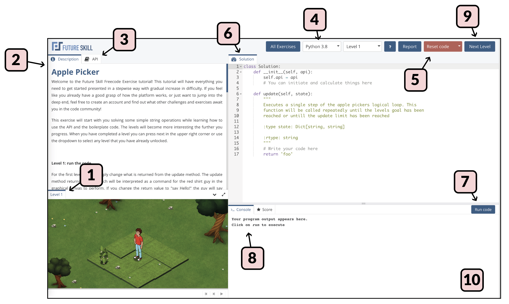

An Exercise is usually aimed at introducing programming concepts or to solve for fun and to challenge yourself.
Exercises have *levels* and in order to complete an exercise, all levels must be solved, which requires receiving a perfect score.
Completing an exercise is often rewarded with *achievements* and *experience* points.

Exercises that have the *Official* tag are either created or endorsed by Future Skill.

## Flow of solving an Exercise

{ loading=lazy }

1. When entering an Exercise you will be presented with level 1, and if the graphical canvas is used you will see it in the bottom left-hand corner with Level 1 visible.
If it is your first time using the Editor a tutorial dialoge window will pop up by the Description tab top left - you will notice it has a "Next tip" button.

2. Start by reading the description text in the top left part of the web page.
Here the problem and what you need to do to solve it is presented and any canvas elements are explained.

3. Click the tab "API" in the top left to read about the methods available to you as you write your code and solve the problem.
Each method can be expanded by clicking it.

4. Now choose the language you want to use to solve the Exercise, the language picker is in the top right part of the page.

5. In the Solution tab, below the language picker, you see the code window where an initial starting point for solving the problem is shown.
You can always return to this initial state by using the red Reset code button, top right.
Read through the available methods and their descriptions, as these are also an integral part of understanding the Exercise.

6. Now edit the code and make a first try at a solution.

7. When you want to try out the effects of your code, and check that the code runs without problems, press the "Run code" button below the code editor window.

8. Any problems with syntax or runtime errors will show up in the Console window bottom right.
If you had none of these the Console might be mostly blank, but you will at least see horizontal blue lines and the step numbers to the very right (e.g. 0/2, 1/2, 2/2 if there are two steps).
The "steps" is mostly a concept which has to do with each animation increment in the canvas, but it usually also corresponds to the number of times your methods are called.
For example, in the "Apple Picker" Exercise the "update" is called once, but the animation has a step 0/2 for the initial render and a step 2/2 to show the end result.
Step 1/2 is when your "update" method is called.

9. Continue working on your code until you have solved Level 1.
When this happens the canvas will typically inform you that you have solved the level correctly, and the "Next Level" button top right will be enabled (it will be a solid blue color).
You can also navigate to the next level in the level picker in the top right part of the page.
Now click the "Next Level" button.

10.  Continue solving Level 2, 3 and so forth until you have solved the entire exercise.
You should see a toast window appear in the bottom right of the page highlighting that you were awarded experience points for solving the Exercise.

## Create your own Exercises

On Future skill it is possible to create your own Exercises!
This is done with the Freecode creator that you can access from the create option.

Read more about the Freecode creator [here](Freecode_creator.md).
