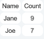
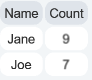

This article goes through how to use the Data library to manage data and create tables in the canvas.


## Overview

The library can currently only be used to make tables, but other types of data views might be available in the future.

The classes provided in this module are not UI elements, but they have a render method that can be used to create an initial element or update the created element.

???+ example "`DataTable` example"
    ``` py
    table = DataTable()
    table[:, :] = [["Name","Count"], ["Jane", 9], ["Joe", 7]]
    table.render(parent=self.canvas, size=self.canvas.size, position=self.canvas.size / 2)
    ```
    

Each type of data manager has an abstract base class which provides the common functionality.

!!! note
    All classes on this page need to be imported from `lib.data`.


## Tables

Tables show data as rows and columns.
A number of leading/trailing rows/columns can be marked as headers/footers and will be handled slightly differently from normal rows/columns.
There are various tools for formatting and styling cells based on position and/or contents.

### Attributes

The following attributes are available for all tables and can be specified in the constructor:

`transpose` - `bool`
: Show rows as columns and vice versa, useful as rows and columns are not functionally identical.

`default_data_formatter` - `Callable[[int, int, Any], str | BaseElement]`
: Used to format all non-header/footer cells that have not already been formatted

`column_data_formatters` - `dict[int, Callable[[int,_int,_Any],_str|BaseElement]] | None`
: Used to format all non-header/footer cells of the indicated columns, other columns are formatted using the default formatter

`default_data_highlighter` - `Callable[[int, int, Any], CellStyle | None]`
: Used to apply highlight styles to all non-header/footer cells that have not already been highlighted

`column_data_highlighters` - `dict[int, Callable[[int,_int,_Any],_CellStyle|None]] | None`
: Used to apply highlight styles to all non-header/footer cells of the indicated columns, other columns are styled using the default highlighter

`default_cell_style` - `CellStyle`
: Used as base style for non-header/footer cells

`default_header_cell_style` - `CellStyle`
: Used as base style for header/footer cells

`default_cell_highlighter` - `Callable[[int, int, AbstractTable], CellStyle]`
: Used to apply base styles for cells, can be used to add patterns to the table, default uses the the default styles

`cell_styles` - `dict[tuple[int, int], CellStyle] | None`
: Overrides the highlight styles for specific cells

`cell_padding` - `float`
: How much padding to add within each cell

`default_row_align` - `"top" | "bottom" | "center"`
: How to align the cell content of all rows unless otherwise specified

`default_column_align` - `"left" | "right" | "center"`
: How to align the cell content of all columns unless otherwise specified

`row_alignments` - `list["top" | "bottom" | "center" | None]`
: Set row alignment for specific rows

`column_alignments` - `list["left" | "right" | "center" | None]`
: Set column alignment for specific columns

`row_proportions` - `list[float]`
: Set row proportions, 0 means divide remaining evenly

`column_proportions` - `list[float]`
: Set column proportions, 0 means divide remaining evenly

`grid_line_size` - `float | None`
: The thickness of the grid lines, `None` disables the lines completely

`compact_mode` – bool (default: False)
: Renders the table with reduced padding and spacing to save screen space.

`fixed_cell_size` – bool (default: False)
: Forces all table cells to have the same fixed width and height, regardless of their content.


### Methods

The following methods are available for all tables:

`table.render()`
: Create or update the UI element for this table, any arguments given to this method is forwarded to the UI element when created

`table.get_cell_value(row, column)`
: Returns the value for the given cell, returns `None` if the cell is empty

`table.get_formatted_value(row, column)`
: Returns the cell value formatted as a text string or as a UI element

`table.get_cell_style(row, column)`
: Returns the highlight style for the given cell

`table.get_cell_style_list(row, column)`
: Returns a list of styles that apply to the given cell, in decreasing priority

`table.get_cell_alignments(row, column)`
: Returns the x and y alignments for the given cell

`table.is_special_row(row)`
: Returns `True` if the row is a header or footer row

`table.is_special_column(column)`
: Returns `True` if the column is a header or footer column


### Calculated properties

The following calculated properties are available for all tables:

`row_count` - `int`
: Total number of table rows, including headers and footers

`column_count` - `int`
: Total number of table columns, including headers and footers

`header_row_count` - `int`
: Total number of header rows

`header_column_count` - `int`
: Total number of header columns

`footer_row_count` - `int`
: Total number of footer rows

`footer_column_count` - `int`
: Total number of footer columns

The `AbstractTable` class is the base class for table data managers.


## `DataTable`

The `DataTable` class is used to create tables by manually entering data.

This is done through indexing:

???+ example "Indexing `DataTable`"
    ``` py
    table = DataTable(header_row_count=1)
    table[1, 1] = 5  # Set value for a single table cell
    table[0, :] = ["Name", "Count"]  # Set values for multiple cells (first row)
    table[1:, :] = [["Jane", 9], ["Joe", 7]]  # Set values for multiple rows and columns
    table.render(parent=self.canvas, size=self.canvas.size, position=self.canvas.size / 2)
    ```
    

The same indexing syntax can be used to extract data from the table.

The data table will automatically keep track of how many rows and columns the table has (based on the highest written row/column).
Currently there is no way to delete/reset cells, so these counts will not be lowered.

You will have to manually specify the number of header/footer rows and columns using `header_row_count`, `header_column_count`, `footer_row_count`, and `footer_column_count`.
