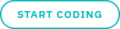
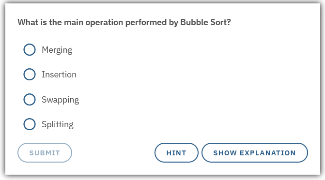
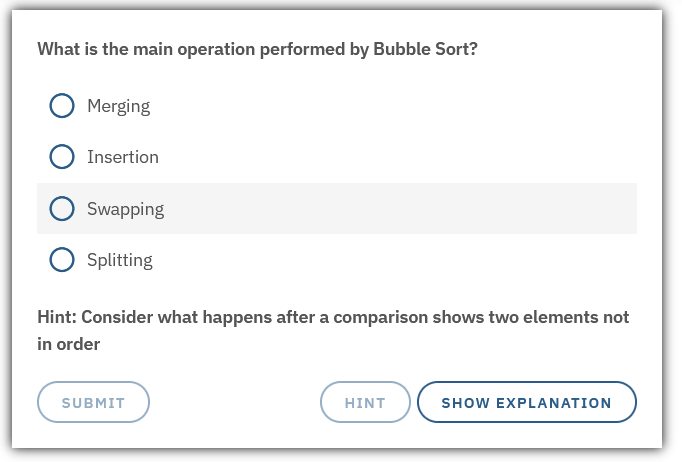
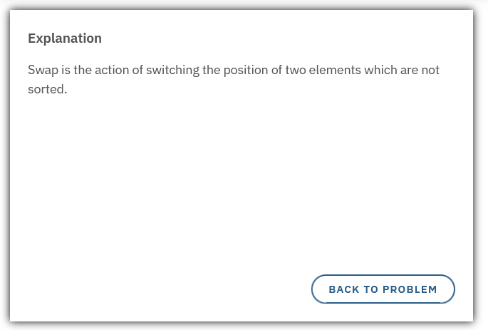
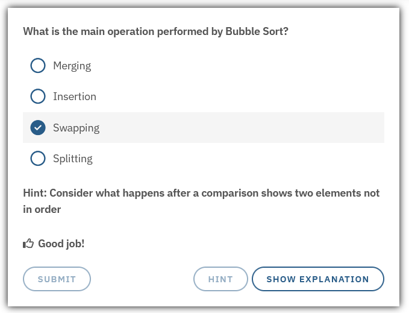
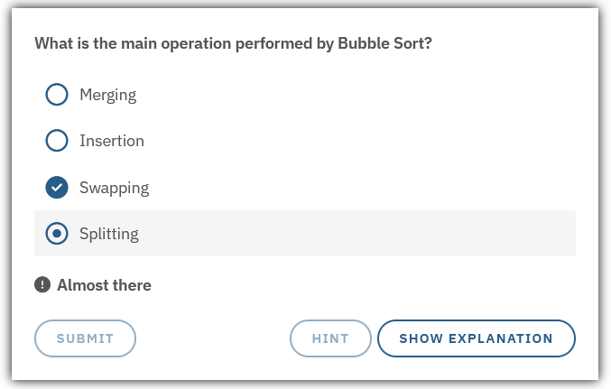

A flow is an overlay that is displayed before the user attempts an exercise level.
This flow should typically contain an overview description of the level with some images, quizzes, and/or interactive canvas.

## Tags

### Levels

Flows nned to be separated for differend levels, so that each level has it's own flow.
To write a flow specific to a level the `[level?]` tag is used - where `?` is the level number starting at 1.

???+ example Level separation
    ```
    [level1]
    This is shown during the flow for Level 1.
    [/level1]
    [level2]
    This is shown during the flow for Level 2.
    [/level2]
    ```
    The above text will depending on which level the user is at render as the following in the flow:
    === "Level 1"
        This is shown during the flow for Level 1.
    === "Level 2"
        This is shown during the flow for Level 2.

!!! warning
    The `[level?]` tags cannot share a row with anything else, not even other `[level?]` tags or their own content.
    

### Continue and Coding Buttons

There are two predefined buttons that can be included for the user to press to continue inside the flow or exit it.

The `[continue]` button is a self closing tag that does not take any content.
It defined the end of a segment within the flow so that everything below it is hidden until the user presses the button.

The `[coding]` button is used as a final button in the flow for the user to exit the flow and go back to the coding editor.
It takes a body which is the button's text.

???+ example "Coding tag for a button with the text "Start coding""
    ```
    [coding]Start coding[/coding]
    ```
    {loading=lazy, width={{ page.meta.width.standard }}}

!!! warning
    It is not possible to have any continue/coding buttons inside language tags (ex. `[english][/english]`).
!!! warning
    `[continue]` and `[coding]` tags cannot share a row with anything else.

### Quiz

A quiz is a question/answer section that the user can interact with and get either right or wrong.

| Name | Description |
|----|----|
| `quiz` | The main wrapping tag |
| `question` | The question that is prompted to the user |
| `hint` | A hint to the user that can help it if needed |
| `explanation` | A more detailed explanation of the question's context |
| `option-correct` | The correct answer to the quiz |
| `option` | An incorrect answer to the quiz |
| `feedback-correct` | The text that is shown to the user if it answers correctly |
| `feedback-incorrect` | The text that is shown to the user if it answers incorrectly |

#### Tags

!!! warning
    **All tags are required**, but if for example `[hint]` or `[explanation]` are left empty they will not render in the flow.

???+ example "Quiz"
    ```
    [quiz]
      [question]What is the main operation performed by Bubble Sort?[/question]
      [hint]Consider what happens after a comparison shows two elements not in order[/hint]
      [explanation]Swap is the action of switching the position of two elements which are not sorted.[/explanation]

      [option-correct]Swapping[/option-correct]
      [option]Merging[/option]
      [option]Insertion[/option]
      [option]Splitting[/option]

      [feedback-correct]Good job![/feedback-correct]
      [feedback-incorrect]Almost there[/feedback-incorrect]
    [/quiz]
    ```
    === "Quiz"
        {loading=lazy, width={{ page.meta.width.wide }}}
    === "Hint"
        {loading=lazy, width={{ page.meta.width.wide }}}
    === "Explanation"
        {loading=lazy, width={{ page.meta.width.wide }}}
    === "Correct answer"
        {loading=lazy, width={{ page.meta.width.wide }}}
    === "Incorrect answer"
        {loading=lazy, width={{ page.meta.width.wide }}}

A `[continue]` or `[coding]` tag is often needed after the quiz.

### Interact

You can add a canvas from one of the levels in a flow.
This can be done using the `[interact-?]` tag - where `?` is the level number starting at 1.

???+ example "Interact tag"
    ```
    [interact-1]
    ```

!!! warning
    A `[continue]` tag is needed before and after the interact tag.


### Other tags

Several other tags which work in the Description are also supported in the flow, such as:

- Language tags, e.g. `[swedish]` and `[english]`

- Programming language tags, e.g. `[python]` and `[c|cpp]`

- Switches with default, for example:
???+ example "Switch with default"
    ```
    [switch]
      [python]"is" or "==" depending on what you are comparing[/python]
      [javascript|typescript]===[/javascript|typescript]
      [default]==[/default]
    [/switch]
    ```
    Depending on which language the user is using it will be rendered as:
    === "Python"
        "is" or "==" depending on what you are comparing
    === "JavaScript"
        ===
    === "TypeScript"
        ===
    === "Some other language"
        ==

- Translation tables, e.g.
???+ example "Translation table, hello"
    ```
    [translate]
      [from]hello[/from]
      [python]HELLO!!!![/python]
      [c|cpp]_h_e_l_l_o_[/c|cpp]
      [default]h e l l o . . .[/default]
    [/translate]
    ```
    If we have the translation table above and write `*hello` in our flow, it will be rendered as something different depending on which language you are using.
    === "Python"
        HELLO!!!!
    === "C"
        \_h\_e\_l\_l\_o\_
    === "C++"
        \_h\_e\_l\_l\_o\_
    === "Some other language"
        h e l l o . . .

???+ example "Translation table, programming language"
    ```
    [translate]
      [from]language[/from]
      [c]C[/c]
      [c_sharp]C#[/c_sharp]
      [cpp]C++[/cpp]
      [go]Go[/go]
      [java]Java[/java]
      [kotlin]Kotlin[/kotlin]
      [javascript]JavaScript[/javascript]
      [typescript]TypeScript[/typescript]
      [php]PHP[/php]
      [python]Python[/python]
      [ruby]Ruby[/ruby]
      [rust]Rust[/rust]
      [scala]Scala[/scala]
      [default]the programming language at hand[/default]
    [/translate]
    ```
    If you have the translation table below and type `*language` in the flow it will show as the language the user is using:
    === "C"
        C
    === "C#"
        C#
    === "C++"
        C++
    === "Go"
        Go
    === "Java"
        Java
    === "Kotlin"
        Kotlin
    === "JavaScript"
        JavaScript
    === "TypeScript"
        TypeScript
    === "PHP"
        PHP
    === "Python"
        Python
    === "Ruby"
        Ruby
    === "Rust"
        Rust
    === "Scala"
        Scala
    === "Some other language"
        the programming language at hand
