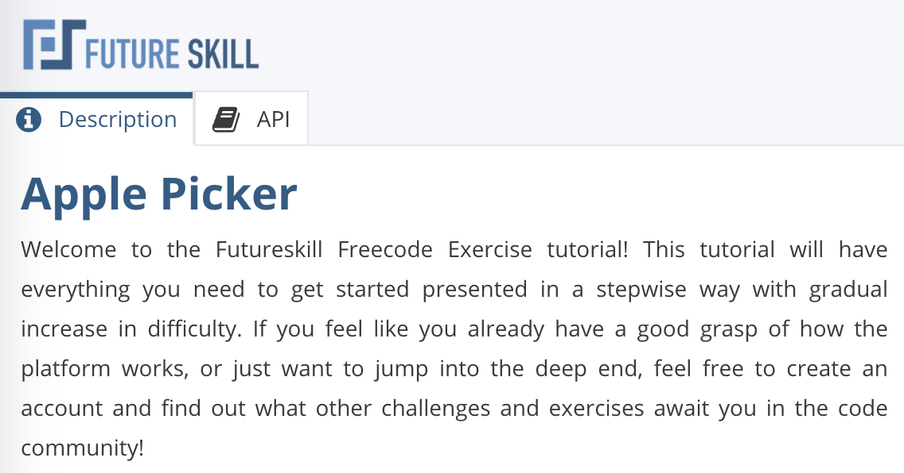

On Future skill it is possible to create your own [Challenges](../basics/Challenges.md), [Exercises](../basics/Exercises.md), and [Freecodes](../basics/Freecodes.md), this is done with the Freecode creator that you can access from the create option when you are signed in.

The Creator is very similar to the Freecode Editor which you can read more about here: [Freecode editor](../basics/Freecode_editor.md)


## The Implementation tab

This is where you as the author design your Freecode. The implementation tab contains the implementation code that is used to run the challenge, call the solutions, generate graphics, and set the scores.

Read more detailed information of how the implementation works here: [Skeletons](Skeletons.md)


## The Solution tab

The solution tab contains a default solution that is used when running the code in the creator.
This is not visible for the Members when opening the Freecode. Here you as the author can create a solution to your own Freecode to try it.
The member will see the methods with just the default return values (See API Tab).
This solution is also the default solution used in contests when there are no other contestants to compete against.


## The API Tab
{ loading=lazy }


### Add Implementation API

The implementation methods are the methods that you as a creator provide to the taker of your Freecode.
This gives the taker the ability to call your API to get information that you make available to them.
Brings up the dialog to add a method to the implementation.
After the method is added the method with the given signature is added automatically to the implementation.


### Add Solution API

The solution methods are the methods that the user that takes the Freecode fills in to create their solution.
Clicking the button brings up the dialog to add a method to the solution.
After the method is added the method with the given signature is added automatically to the solution.


### Regenerate Skeletons

Regenerates the skeletons for all the different languages.
These can be viewed under the Preview tab.
This is what the user who takes the Freecodes starts from.
The python skeleton is equivalent to what you see in the solution tab after you press "Reset Solution"


### Reset Implementation

Resets the implementation.
This will remove any code written by you in the implementation tab and give you the empty skeleton code with the implementation methods from the API tab.


### Reset Solution

Resets the solution.
This will remove any code written by you in the solution tab and gives you the empty methods from the solution API.
This can be good to use if you have added and removed Solution APIs and want to make sure you are writing for the latest functions.


## Create API Method

All method names must be space-separated list of words containing lowercase letters and can't start with a number.
Specific language formatting is applied automatically.
Default return values for different return types in solution methods: 
{ loading=lazy }
```
Int: -2

float: -2.0

Bool: False

string: 'Foo'

list[]: A list can only contain one of the other types, ie int, float, bool, or string.

Map: {}: A map can only contain one type of key and one type of value.
 The types of the key and value can be different. The key and value can only be of the int, float, bool, or string.
```
For implementation methods you get raise NotImplementedError('"APImethod" not implemented') as default regardless of the return type.


## The graphics tab

This tab contains settings for how the implementation should use the canvas and manages the default landing page background and thumbnail.
Some settings might disable other settings, if canvas is disabled there will be no other canvas settings available.


### Canvas Animation

If the canvas should be used, if it should be animated, and if the implementation supports human input.
If the canvas is animated then there is also a setting for how long each animation step should be.


### Images

Here you can upload images to be used as graphical elements in the canvas.
The possible usages are individual bitmaps or as sprite sheets.

Images should typically be PNG image files with transparent backgrounds for the best result.
There are many built in images that can be accessed without any need to upload them, see [Built in images](Images.md) for a full list.

Sprite sheets needs a separate image atlas that define where each image in the sheet is placed, this atlas has to be in json format compatible with pixi.js.
You can read more about this on the [Create Prite Sheet](Create_Sprite_Sheet.md) page.


### Background Color

The canvas background color is the color that will be displayed as a background behind any graphical elements that are added in the implementation.


**Default background colors:**

- Light mode: \#F6FAFF
- Dark mode: \#3A4556


### Resolution

The resolution decided the dimensions of the canvas element, and what coordinates should be used to display elements in the implementation.
10x20 will have the same dimensions as 100x200, but in order to display graphics precise locations in a 10x20 canvas you might have to use more decimal points than if the canvas is 100x200.


### Landing Page Image

The default landing page image used by challanges and exercises.
This image will be used as both background and thumbnail for the implementation.


## Settings Tab

A mismatch between the total number of levels and the number of levels in the implementation _configurations variable will lead to an error.


### Tournament

These options are only visible when the type of Freecode is set to Challenge.

Is Tournament: For an explanation of the difference between Challenge and tournament see: [Coding Community](../basics/Coding_Community.md)

Number of players: if isTournament this setting will determine the number of solution that will compete against each other in every run.


### Test case levels

Public levels: These are the levels that the members can see when taking your Freecode.

Exercise: For exercises there are only public levels, however only 1 is available at the time. This means the member must complete one levels before being able to continue to the next one.
There is no hidden scoring here.

Code test and challenges: The public levels are what is visible to the member when taking the Freecode.
These are the levels that they can try their solutions against and see if they pass.
These levels are not used in scoring the Freecode.
That is handled in the hidden and performance levels.

Hidden levels: This is only used for the "Code test" and "Challenge" type of Freecode.
These levels are hidden and can't be seen by the member.
These are the levels that are used for the scoring of the Freecode.
So normally extra edge cases are used in these levels to see that the members solution can handle all the edges that you are a part of the Freecode.

Performance levels: This is only used for the Code test type of Freecode.
On top of the normal correctness check of the solution an additional check of how much times was used is added.
You as the author must specify this time limit in milliseconds for each of the programming languages available on Future Skill.
For performance levels using much larger input data is recommended.
The time limit if set per language.


### Good performance scores

Only available for code tests with Performance levels.


### Executor

Executor: The executor version used - normally this will not affect your work in the Freecode Creator but it's provided for informational purposes.
Different versions provide different functionality but may require changes on the implementation.
This is locked and can only be changed by super-admins.


### Freecode

Allow others to copy your Freecode: When this is checked your Freecode will be available to other community members to copy and use as a starting point for their own Freecodes.
Only checking this will not allow them to see your solution.
So it cant be used for cheating.

Make solution publicly available: When you make your solution available members will be able to see and copy your solution.
So this can lead to "cheating", especially in the case of Exercises.


### Versioning

Manage versions of the implementation.
Using this it is only possible to move forwards in versions with 1 live version and 1 work in progress version.
It is still possible to open old versions and export them to test them out or to import as the current version.


## The Preview Tab

The preview tabs show you the code the user from use as a starting point in the available languages.

You can also see the API methods available to the user with the languages specific formatting.
The solution methods are the method signatures the user taking the Freecode will see and are the same methods that are in the skeletons above.
The Challenge methods are the signatures for the API tab the member will see and use when taking the Freecode.

Landing page tab

In this tab it is possible to upload a custom background image that will be used on the published challenges landing page.


## Descriptions

{ loading=lazy }


### Summary

This is the public description used externally to entice participants and to give a brief overview of what the challenge or exercise contains and/or should teach/test.


### Description

This is the descriptions that a user can see in the editor when participating in a challenge or taking an exercise.
This description should contain details about what to do, how it can be done, and how the result will be scored.

You can use special tags to manage what text is displayed.
To write text which only is visible when Level 1 is selected in an exercise, write:
???+ example "Using level tags"
    ```
    [level1]
    This text is for level 1
    [/level1]
    ```
You can also use `[level2]`, `[level3]` and so forth.

To write text only visible when certain languages are selected you can change the value in the tags to one of c, c_sharp, cpp, go, java, javascript, php, python, ruby, scala, typescript, rust, kotlin.

???+ example "Using language tags"
    ```
    [python]
    This text is only visible if you are using python
    [/python]
    Your language tag is: [c]c[/c][c_sharp]c_sharp,[/c_sharp][cpp]cpp[/cpp][go]go[/go][java]java[/java][javascript]javascript[/javascript][php]php[/php][python]python[/python][ruby]ruby[/ruby][scala]scala[/scala][typescript]typescript[/typescript][rust]rust[/rust][kotlin]kotlin[/kotlin]
    ```
You can also do tags that are visible for multiple levels and/or languages by separating the tags with \|

???+ example "Combining tags"
    ```
    [c|cpp]Your language is either C or C++[/c|cpp]
    [level1|level2]
    This text is visible for both the first and second level!
    [/level1|level2]
    ```

If you want a default value there is also a switch options.

???+ example "Using a switch tag"
    ```
    Here is a logical equals operator: [switch]
    [python]"is" or "==" depending on what you are comparing[/python]
    [javascript|typescript]===[/javascript|typescript]
    [default]==[/default]
    [/switch]
    ```

Finally there is also a translation dict that can replace multiple instances of the same text based on the contents.
The text to replace must be prepended with a \*.
Each word or phrase to replace needs its own translation definition.
If there is no match or default text the from text will be replaced with an empty string.

???+ example "Using a translate tag"
    ```
    HELLO: *hello
    hello - *hello - hello
    [translate]
    [from]hello[/from]
    [python]HELLO!!!![/python]
    [c|cpp]_h_e_l_l_o_[/c|cpp]
    [default]h e l l o . . .[/default]
    [/translate]
    ```

### Run Code

"Run Code" will let you run your solution like you are a member taking the Freecode.
You will see the output in the canvas and console just like if you were taking the Freecode as a member.
If you are creating a challenge or Code test you will see the text "run hidden levels" next to the "Run Code" button.
If you check this you will also see the result for the hidden levels.
This option is not available to members taking the Freecode.
