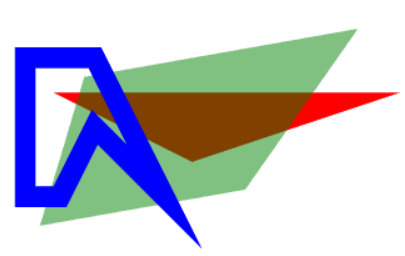
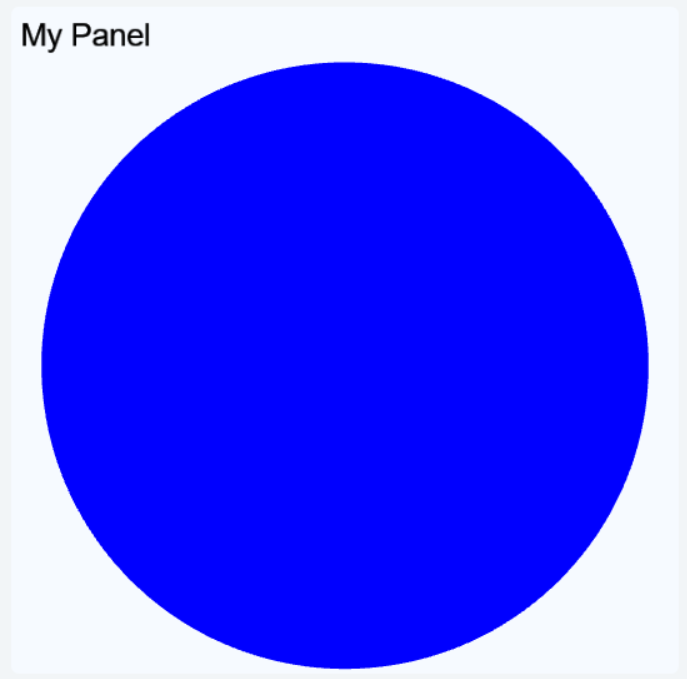

This article goes through how to use the Freecode canvas and the UI library.

## How to use the canvas

Depending on what skeleton you are using, the way you add your graphics to the canvas differs.
The templates for either skeleton will include an example of using the canvas.

If you use [`BasicChallenge`](Skeletons.md#basicchallenge) (or no skeleton) you will want to manually add the elements to the canvas, like so:
???+ example "Manually adding elements to canvas"
    ``` py
    def setup_canvas(self):
        self.my_rectangle = Rectangle(x=10, y=10, color="green", parent=self.canvas)
    ```

If you use [`StageChallenge`](Skeletons.md#stagechallenge) or [`GameChallenge`](Skeletons.md#gamechallenge) you will want to return the element in the `setup_view` method:
???+ example "Implicitly adding element to canvas"
    ``` py
    def setup_view(self):
        self.my_rectangle = Rectangle(color="green")
        return self.my_rectangle
    ```

!!! note
    You specify neither parent nor position in `setup_view`, this is done for you.

Either way you will get a canvas containing only a green square.

{loading=lazy, width={{ page.meta.width.standard }}}


## Overview

The UI library is object oriented, meaning that the graphical elements are represented by Python objects.
You create a new element by creating a new object and you can modify the elements by modifying the objects.
An element will not show up on the canvas unless the object has the canvas as a parent (or grandparent, or great grandparent, and so on).

A child element will inherit some of the attributes from it's parent.
They will be positioned relative to the parent, scaled according to the parent, and opacity of the parent is applied.
A child with opacity of `0.5` and with a parent with opacity of `0.5` will in effect have an opacity of `0.25`.

When creating an element object, you can (and sometimes must) include a number of attributes.
You can use any of the names listed here, e.g. `width` or `w` or `size_x`.
The same names can be used to get or modify the attributes later on.

???+ example "Accessing attributes"
    ``` py
    my_rect = Rectangle(w=8, h=6, x=10, y=12, parent=self.canvas)
    my_rect.width = 4
    my_rect.color = "blue"
    ```

All elements can have a parent, and some can have children.
If an element switches parent it will be removed from the previous parent's list of children.
You can either use the `parent` attribute or the `.add_child(child)`/`.remove_child(child)` methods to update the hierarchy.
But remember that for an element to show up in the canvas it needs to have it as an ancestor.

The following section and subsections will detail the different elements available in the UI library, grouped by similarities.
Many elements have common attributes, which are detailed in their own section to make things cleaner.


## Elements

All these elements can be imported from the `lib.ui` package, along with any of the enums and constants listed here.

???+ example "Importing and using an element"
    ``` py
    from lib.ui import Rectangle, Text

    my_rect = Rectangle(children=[Text("Hello", color="white", font_size=30)])
    ```
    {loading=lazy, width={{ page.meta.width.standard }}}

Remember to add the element to the import list, or you will get an error.

All elements extend either the `BaseElement` or `ContainerElement` base class which provides the [`common`](UI.md#common) and [`container`](UI.md#container) attributes and methods.


### Shapes

These elements are used to make geometric shapes, either filled or outlines.
Use `Polygon` to make additional shapes such as triangles and hexagons.
For more complex shapes, consider using images instead.


#### `Rectangle`

Used to make squares, rectangles and rounded rectangles.

General attributes/methods:
[`common`](UI.md#common),
[`container`](UI.md#container),
[`shape`](UI.md#shape),
[`action`](UI.md#action),
[`click`](UI.md#click),
[`drag`](UI.md#drag),
[`keyboard`](UI.md#keyboard)

`corner_radius` - `float | None` S  
: Add rounded corners to the rectangle

???+ example "Creating three `Rectangle` objects"
    ``` py
    self.my_rectangle = Rectangle(color="white", children = [
        
        # Wide rectangle
        Rectangle(w=4, h=2, x=0, y=0, color="#FF6347"),
        
        # Rotated square
        Rectangle(w=2, h=2, x=-1, y=-1, color="red", rotation=60),
        
        # Hollow square
        Rectangle(w=2, h=2, x=0, y=0, color="green", rotation=-20, stroke=0.2, opacity=0.3)
    ])
    ```
    {loading=lazy, width={{ page.meta.width.standard }}}


#### `Circle`

Used to make circles.

General attributes/methods:
[`common`](UI.md#common),
[`container`](UI.md#container),
[`shape`](UI.md#shape),
[`action`](UI.md#action),
[`click`](UI.md#click),
[`drag`](UI.md#drag),
[`keyboard`](UI.md#keyboard)

`radius`/`r` - `float` S  
: The radius of the circle, use instead of `width`/`height`

`min_radius`/`min_r` - `float`  
: The minimum radius for this element, does not affect the current radius

`max_radius`/`max_r` - `float`  
: The maximum radius for this element, does not affect the current radius

`fixed_radius` - `bool`  
: Prevents automatic resizing of the circle

???+ example "Creating three `Circle` objects"
    ``` py
    self.my_rectangle = Rectangle(color="white", children = [
        
        # Red circle
        Circle(r=1, color="red", x=-1),
        
        # Blue circle
        Circle(r=1, color="blue", x=1, y=1),
        
        # Green ring
        Circle(r=0.8, color="green", x=0, y=1, stroke=0.1)
    ])
    ```
    {loading=lazy, width={{ page.meta.width.standard }}}


#### `Polygon`

Used to make any other straight edge shapes.
Consider using images if you need a large number of points.

General attributes/methods:
[`common`](UI.md#common),
[`container`](UI.md#container),
[`shape`](UI.md#shape),
[`action`](UI.md#action),
[`click`](UI.md#click),
[`drag`](UI.md#drag),
[`keyboard`](UI.md#keyboard)

`points` - `list[tuple[float, float]]` R  
: A list of points to use to draw the polygon, required and positional

`bounds` - `tuple[tuple[float, float], tuple[float, float]]` S  
: The bounds of the polygon used to determine size and pivot, calculated if omitted

???+ example "Creating three `Polygon` objects"
    ``` py
    self.my_rectangle = Rectangle(color="white", children = [
        # Red triangle
        Polygon([(0, 0), (5, 0), (2, 1)], color="red", x=0.4, y=0, z_index = 1),
        
        # Blue line
        Polygon([(0, 0), (0, 2), (0.5, 2), (1, 1), (2, 2), (1, 0)], color="blue", x=-1.5, y=0, stroke=0.3, z_index=3),
        
        # Green quadrilateral
        Polygon([(0, 0), (-2, 2), (2, 2), (3, 0)], color="green", x=0, y=0, opacity=0.5, rotation=170, z_index=2)
    ])
    ```
    {loading=lazy, width={{ page.meta.width.standard }}}


#### `ComplexShape`

Used to make a shape with straight or Bézier curves.
Consider using images if you need very complex shapes or a large number of points.

General attributes/methods:
[`common`](UI.md#common),
[`container`](UI.md#container),
[`shape`](UI.md#shape),
[`action`](UI.md#action),
[`click`](UI.md#click),
[`drag`](UI.md#drag),
[`keyboard`](UI.md#keyboard)

`segments` - `list[list[tuple[float, float]]]` R  
: A list of segments (list of points) to use to draw the shape, required and positional
: Each segment must consist of one to three points (first must be one point):
: - Single point means a straight line to that point
: - Two points is a quadratic Bézier curve with a control point (first) and an end point (second)
: - Three points is a cubic Bézier curve with two control points and an end point (last)

`bounds` - `tuple[tuple[float, float], tuple[float, float]]` S  
: The bounds of the shape used to determine size and pivot, calculated if omitted

`closed` - `bool` S  
: Whether the shape should be closed or not

???+ example "Creating a `ComplexShape`"
    ``` py
    self.my_rectangle = Rectangle(color="white", children = [
        ComplexShape([[(0, 0)], [(5, 5), (0, 10)], [(10, 10)], [(5, 5), (15, 5), (10, 0)], [(0, 0)], [(5, 5), (0, 10)], [(10, 10)], [(5, 5), (15, 5), (10, 0)]], color="green")
    ])
    ```
    {loading=lazy, width={{ page.meta.width.standard }}}


### Text

These elements can be used to display text.


#### `Text`

Simple text element.
The size is based on the text string and font size.

General attributes/methods:
[`common`](UI.md#common),
[`action`](UI.md#action),
[`click`](UI.md#click),
[`drag`](UI.md#drag),
[`keyboard`](UI.md#keyboard)

`text` - `str`  
: The text to display, required and positional

`color` - `str`  
: The text color

`font_size` - `float`  
: The text font size

`align_x` - `"left" | "right" | "center"`  
: The horizontal text align

???+ example "Creating a `Text`"
    ``` py
    self.my_rectangle = Rectangle(color="white", children = [
        Text("Hello\nWorld!", font_size=5, color="orange")
    ])
    ```
    {loading=lazy, width={{ page.meta.width.standard }}}


#### `DynamicText`

Alternative to `Text` where the text is adjusted to fit within the size rather than the other way around.

General attributes/methods:
[`common`](UI.md#common),
[`action`](UI.md#action),
[`click`](UI.md#click),
[`drag`](UI.md#drag),
[`keyboard`](UI.md#keyboard),
[`fit to content`](UI.md#fittocontent)

`text` - `str`  
: The text to display, required and positional

`color` - `str`  
: The text color

`font_size` - `float`  
: The text font size

`align_x` - `"left" | "right" | "center"`  
: The horizontal text align

`align_y` - `"top" | "bottom" | "center"`  
: The vertical text align

???+ example "Creating a `DynamicText`"
    ``` py
    self.my_rectangle = Rectangle(color="white", children = [
        DynamicText("Hello\nWorld!", font_size=5, color="orange", w=10)
    ])
    ```


#### `HtmlArea`

Used to add a block of text that can be formatted using HTML code.
If the content is wider or taller than the element size, a scrollbar will appear.
It is possible to include images and CSS, using normal HTML syntax.

General attributes/methods:
[`common`](UI.md#common),
[`scroll`](UI.md#scroll)

`html` - `str`  
: The HTML text to display, required and positional

`font_size` - `float`  
: The text font size

`align_x` - `"left" | "right" | "center"`  
: The horizontal text align

`disable_scroll` - `bool`  
: Disables scroll and all ScrollArea features so it will limit the HtmlArea to its width and height.

`disable_auto_font_scale` - `bool`  
: Disables auto font scale and the text font size will be applied.

???+ example "Creating an `HtmlArea`"
    ``` py
    self.my_rectangle = Rectangle(color="white", children = [
        HtmlArea("Hello <b>World</b>!", font_size=4, w=15, h=15, disable_scroll=True, disable_auto_font_scale=True)
    ])
    ```
    {loading=lazy, width={{ page.meta.width.standard }}}


### Graphics

These elements can be used to display images and animations.


#### `Image`

Displays a static image.

General attributes/methods:
[`common`](UI.md#common),
[`action`](UI.md#action),
[`click`](UI.md#click),
[`drag`](UI.md#drag),
[`keyboard`](UI.md#keyboard)

`image` - `str` S  
: The name of the image to show

`color` - `str`  
: A color to use for tinting the image

???+ example "Creating three `Image` objects"
    ``` py
    self.my_rectangle = Rectangle(color="white", children = [
        # Left cat
        Image("std_katniss_standing.webp", w=4, h=3),
        
        # Slightly squished cat
        Image("std_katniss_standing.webp", w=4, h=2, x=4, y=1.5),
        
        # Red background cat
        Image("std_katniss_standing.webp", w=8, h=4, x=2, y=2, rotation=20, color="red", opacity=0.3, z_index=-1, scale_x=-1)
    ])
    ```
    {loading=lazy, width={{ page.meta.width.standard }}}

!!! note
    There are many images provided by the framework that can be accessed simply by using their names as the `image` string.
    You can find them all in [Built in images](Images.md).


#### `Sprite`

Displays an animated image.
See [Create Sprite Sheet](Create_Sprite_Sheet.md) to learn about creating a sprite sheet.

General attributes/methods:
[`common`](UI.md#common),
[`action`](UI.md#action),
[`click`](UI.md#click),
[`drag`](UI.md#drag),
[`keyboard`](UI.md#keyboard)

`image` - `str` S  
: The name of the sprite sheet to show

`color` - `str`  
: A color to use for tinting the image

`animation`/`anim` - `str` S  
: The name of the animation to play, use `"default"` for the default animation

`start_frame`/`start` - `int | None` S  
: An animation frame to start on

`end_frame`/`end` - `int | None` S  
: An animation frame to end on

???+ example "Creating three `Sprite` objects"
    ``` py
    a = Sprite("weird_sheet.png", w=2, h=2, x=1, y=1)
    b = Sprite("weird_sheet.png", w=2, h=2, x=3, y=1, start=2, end=0, scale_x=-1)
    c = Sprite("weird_sheet.png", w=1.5, h=2, x=5, y=1, animation="just_display_guy")
    ```
    {loading=lazy, width={{ page.meta.width.standard }}}


### Containers

These elements can be used to fit more content in the canvas.


#### `ScrollArea`

Use when you want some content to be scrollable (vertical and/or horizontal).

General attributes/methods:
[`common`](UI.md#common),
[`scroll`](UI.md#scroll)

???+ example "Creating a `ScrollArea`"
    ``` py
    scroll = ScrollArea(w=40, h=20)
    Text("Hello World!", font_size=20, parent=scroll)
    ```


#### `TabArea`

Use when you want to split up some content into tabs.
Consider putting tab content into `ScrollArea`s for even more space.

General attributes/methods:
[`common`](UI.md#common),
[`style`](UI.md#style)

`tabs` - `dict[str, BaseElement]`  
: The tab names and content to include, required and positional, constructor only

`font_size` - `float`  
: The font size to use for the tab headers

???+ example "Creating a `TabArea`"
    ``` py
    red = Rectangle(color="red", children=[Text("R", font_size=20)])
    green = Rectangle(color="green", children=[Text("G", font_size=20)])
    blue = Rectangle(color="blue", children=[Text("B", font_size=20)])

    TabArea({"Red": red, "Green": green, "Blue": blue}, w=30, h=50)
    ```


### Layouts

These elements can be used to simplify positioning of elements.
They handle addition, removal and resizing of elements as well.
Also, these elements cascade resizing down to any children.
Other elements like `Rectangle` are resized if the parent is a `Layout` element, but a `Rectangle` doesn't cascade resizing to its children.


#### `Horizontal`

Used to position elements horizontally.

General attributes/methods:
[`common`](UI.md#common),
[`layout`](UI.md#layout)

All positional arguments are added as children.

`proportions` - `list[float]`  
: Proportions of size to give to each element, 0 means an even proportion of the remaining space

???+ example "Creating a `Horizontal`"
    ``` py
    Horizontal(Rectangle(color="yellow"), Rectangle(color="magenta"), Rectangle(color="cyan"))
    ```
    {loading=lazy}


#### `Vertical`

Used to position elements vertically.

General attributes/methods:
[`common`](UI.md#common),
[`layout`](UI.md#layout)

All positional arguments are added as children.

`proportions` - `list[float]`  
: Proportions of size to give to each element, 0 means an even proportion of the remaining space

???+ example "Creating a `Vertical`"
    ``` py
    Vertical(*[Text(str(i)) for i in range(5)], spacing=5)
    ```
    {loading=lazy}


#### `Grid`

Used to position elements in a grid.

General attributes/methods:
[`common`](UI.md#common),
[`layout`](UI.md#layout)

All positional arguments are added as children.

`rows` - `int`  
: Number of rows in the grid, calculated if not set

`columns` - `int`  
: Number of columns in the grid, calculated if not set

`transpose` - `bool`  
: Whether to place columns first, rather than rows first

`alignments` - `tuple[list["left" | "right" | "center" | None], list["top" | "bottom" | "center" | None]`  
: Alignments for each column or row and column, `None` means use the `align_x/align_y` value

`proportions` - `tuple[list[float], list[float]`  
: Proportions of size to give to each row and column, `0` means an even proportion of the remaining space

???+ example "Creating a `Grid`"
    ``` py
    Grid(*[Text(str(i)) for i in range(20)], columns=5, w=30, h=30, spacing=5)
    ```
    {loading=lazy}


### Controls

These elements are interactive UI elements mostly useful in interact mode.


#### `Button`

Used to create a button.

General attributes/methods:
[`common`](UI.md#common),
[`style`](UI.md#style),
[`action`](UI.md#action),
[`click`](UI.md#click),
[`fit to content`](UI.md#fittocontent)

`text` - `str`  
: The text on the button, required and positional

`font_size` - `float`  
: The font size of the button text

`align_x` - `"left" | "right" | "center"`  
: The horizontal text align

`align_y` - `"top" | "bottom" | "center"`  
: The vertical text align

`padding` - `float`  
: Padding around the text within the button

`border_size` - `float | None`  
: The thickness of the border around the button

`corner_radius` - `float | None`  
: The radius of the corners of the button, set to `None` for a square button

`overlay` - `bool`  
: Whether to use the overlay styling for this button or not

`primary` - `bool`  
: Whether to use the primary styling for this button or not

`enabled` - `bool` S  
: If set to `False` will both disable click callbacks and use the disabled styling

???+ example "Creating a `Button`"
    ``` py
    def callback(event):
        print("Button clicked!")

    Button("Click me!", on_click=callback)
    ```


#### `Checkbox`

Use to create a checkbox.

General attributes/methods:
[`common`](UI.md#common),
[`style`](UI.md#style),
[`action`](UI.md#action),
[`click`](UI.md#click)

`checked` - `bool` S  
: Whether the checkbox is checked or not

`intermediate` - `bool` S  
: Whether the checkbox is in an intermediate state or not

`intermediate_value` - `bool`  
: The checked value to use when the checkbox is in an intermediate state

`text` - `str | None`  
: The label next to the checkbox

`font_size` - `float`  
: The font size of the checkbox label

`solid` - `bool` S  
: Whether to use the solid icons for this checkbox or not

`enabled` - `bool` S  
: If set to `False` will both disable click callbacks and use the disabled styling

`on_change` - `(CheckboxEventData) -> None` E  
: Called whenever the checkbox changes state

???+ example "Creating a `Checkbox`"
    ``` py
    def callback(event):
        print("Checkbox was checked" if event.checked else "Checkbox was unchecked")

    Checkbox(scale=4, on_change=callback)
    ```


### Panels

These elements can be used to visually separate a set of other elements.


#### `Panel`

A simple panel.
Can have a title and a title image.
Can also have content with will be resized based on the panel size.

General attributes/methods:
[`common`](UI.md#common),
[`style`](UI.md#style)

`content` - `BaseElement` R  
: Content to but inside the panel, constructor only

`title` - `str` R  
: A title for the panel, constructor only

`title_image` - `str`  
: An image to put in the top-right corner of the panel, only visible if a title is set

`font_size` - `float`  
: The font size of the title text

`corner_radius` - `float | None`  
: The radius of the corners of the panel, set to `None` for a square panel

`overlay` - `bool`  
: Whether to use the overlay styling for this panel or not

`spacing` - `float`  
: The distance between the title and content

`padding` - `float`  
: The distance between panel content/title and the outer edge

???+ example "Creating a `Panel`"
    ``` py
    Panel(w=50, h=50, content=Circle(color="blue"), title="My Panel")
    ```
    {loading=lazy, width={{ page.meta.width.standard }}}


#### `Toolbar`

A panel with three distinct areas: left, right, and center.
Children within each area are arranged horizontally.

General attributes/methods:
[`common`](UI.md#common),
[`style`](UI.md#style)

`corner_radius` - `float | None`  
: The radius of the corners of the panel, set to `None` for a square panel

`overlay` - `bool`  
: Whether to use the overlay styling for this panel or not

`spacing` - `float`  
: The distance between children within each area

`padding` - `float`  
: The distance between toolbar content and the outer edge

???+ example "Creating a `Toolbar`"
    ``` py
    Toolbar(
        w=80,
        h=10,
        fixed_height=True,
        left_children=[Circle()],
        right_children=[Rectangle()],
        center_children=[Text("TOOLBAR")],
    )
    ```
    {loading=lazy, width={{ page.meta.width.standard }}}


#### `Popup`

A popup panel with a message and ability to add buttons.
The popup needs to be activated by [toggling](UI.md#toggling).
Clicking any of the popup buttons will close the popup.
Only works properly in interact mode.

General attributes/methods:
[`common`](UI.md#common),
[`style`](UI.md#style)

`text` - `str` R  
: The message to display, required and positional, constructor only

`buttons` - `list[Button]` R  
: The buttons to include, required and positional, constructor only

`corner_radius` - `float | None`  
: The radius of the corners of the panel, set to `None` for a square panel

`overlay` - `bool`  
: Whether to use the overlay styling for this panel or not

`spacing` - `float`  
: The distance between buttons

`padding` - `float`  
: The distance between popup content and the outer edge

???+ example "Creating a `Popup`"
    ``` py
    def callback(event):
        print("Deal!")

    buttons = [Button("OK", primary=True, on_click=callback), Button("Cancel")]
    popup = Popup("My Popup!", buttons, w=30, h=15, anchor_y=1, y=-5)
    Rectangle(size=10, hover_targets=[popup], children=[popup])
    ```


### Specialized

These elements are not as generally useful as the others, but are very useful for specific tasks.


#### `Board`

Use to create a chess-like game board of square grids.
If you need something more dynamic or want more features, take a look at [World](World.md).

You can place elements on the board by coordinates, e.g. `board[0, 2] = Circle(color="red")`.
The elements will automatically be positioned and resized to match the specified square.
There can only be one element at each coordinate, which can be fetch like so: `board[0, 2]`.

General attributes/methods:
[`common`](UI.md#common),
[`style`](UI.md#style)

`rows` - `int` R  
: How many rows the board should have

`columns` - `int` R  
: How many columns the board should have

`line_size` - `float`  
: The thickness of the grid lines

`edge_size` - `float`  
: The thickness of the edge outside the grid

`font_size` - `float`  
: The font size of the square coordinate labels

`row_labels` - `list[str]` R  
: The labels to use for the rows, you can use the constants `LOWERCASE_LABELS`, `UPPERCASE_LABELS`, and `NUMBER_LABELS`

`column_labels` - `list[str]` R  
: The labels to use for the columns, you can use the constants `LOWERCASE_LABELS`, `UPPERCASE_LABELS`, and `NUMBER_LABELS`

`invert_rows` - `bool` R  
: Will draw the rows bottom to top rather than top to bottom

`invert_columns` - `bool` R  
: Will draw the columns right to left rather than left to right

`corner_radius` - `float | None`  
: The radius of the corners of the board, set to `None` for a square panel

`overlay` - `bool`  
: Whether to use the overlay styling for this board or not

???+ example "Creating a `Board`"
    ``` py
    def callback(event):
        event.source.color = "orange"

    board = Board(size=64)
    for r in range(board.rows):
        for c in range(board.columns):
            board[r, c] = Circle(scale=0.9, color="green", on_click=callback)
    ```
    {loading=lazy, width={{ page.meta.width.standard }}}


#### `Stage`

This element is primarily used by the [`StageChallenge`](Skeletons.md#stagechallenge) and [`GameChallenge`](Skeletons.md#gamechallenge) skeletons.
It is recommended to use those rather than using this element directly.

General attributes/methods:
[`common`](UI.md#common),
[`style`](UI.md#style)

`content` - `BaseElement` R  
: The main content to put in the middle of the stage, required and positional, constructor only

`info_panel` - `BaseElement | None` R  
: Optional content to put on the left-hand side, constructor only

`tabs` - `dict[str, BaseElement]` R  
: Tabs to show on the right-hand side, constructor only

`show_toolbar` - `bool` R  
: Whether to show the toolbar or not, constructor only

`center_buttons` - `list[Button]` R  
: Buttons to put in the center of the toolbar, constructor only

`right_buttons` - `list[Button]` R  
: Buttons to put to the right of the toolbar, constructor only

`info_prompt` - `str`  
: Text to show in the toolbar on the lower left

`spacing` - `float`  
: Distance between the areas of the stage

`toolbar_height` - `float`  
: The height of the toolbar


#### `SpeechBubble`

Use to create a speech bubble. Mainly used by the `.say(...)` command for character actors in [World](World.md).

General attributes/methods:
[`common`](UI.md#common),
[`fit to content`](UI.md#fittocontent)

`text` - `str` S  
: The text within the speech bubble, required and positional

`font_size` - `float` S  
: The desired text font size

`settings` - `SpeechBubbleSettings` S  
: Specifies the shape of the speech bubble:
: - `radius` - The radius of the speech-bubble "corners"
: - `tail_inset` - How far in the tail should be positioned (x-offset)
: - `tail_width` - How thick the tail should be
: - `tail_height` - How tall the tail should be
: - `tail_point_offset` - How the tail tip should be positioned (x-offset)
: - `tail_position` - Where to put the tail, one of "bottom_left", "bottom_right", "top_left", or "top_right"
: - `shadow_height` - How high up the lower shading of the bubble should go
: - `edge_size` - How thick the edge around the bubble should be

`theme` - `SpeechBubbleTheme`  
: Specifies the color scheme of the speech bubble:
: - `text_color` - The color of the text
: - `bubble_color` - The background color of the bubble
: - `shadow_color` - The shading color of the bubble
: - `edge_color` - The color of the bubble edge

`auto_fit` - `bool`  
: Whether to automatically resize the bubble to fit the text or not, can use `.fit_to_content()` manually

`auto_anchor` - `bool`  
: Whether to automatically anchor the element position to the tail tip or not, can use `.anchor_at_tail()` manually


#### `Table`

Extends the `Grid` element with grid lines.
It is recommended to use a [data manager](Data.md).

Almost identical to `Grid`, but with the following additional attributes:

`style` - `Style`  
: See [styling](UI.md#styling)

`line_size` - `float | None`  
: The thickness of the grid lines, use `None` to remove the lines


## Attributes / Methods

This section lists the attributes and methods common among several elements, check each element above for which apply.

A few attributes are marked with a letter, they have the following meanings:

C - coordinate
: This attribute is a coordinate property, see [Coordinates](UI.md#coordinates)

E - event callback
: This attribute is an event callback, see [Events](UI.md#events)

R - readonly
: This attribute can not be updated (or animated)

S - static
: This attribute can not be animated, see [Animation](UI.md#animation)


### Common

`parent` - `Container | None` S  
: The parent of the element

`size` - `tuple[float, float]` C  
: The size (width and height) of the element
: Some elements calculate these values based on other attributes, in which case the size is read-only

`.request_size(size)`  
: Ask the element to adjust its size to match the given size, taking into account min and max size and other restrictions

`.request_size(size, time)`
: Same as above but using an animation time, see [Animation](UI.md#animation)

`size_x`/`width`/`w` - `float`  
: The width of the element, component of `size`

`.request_width(width)`  
: Ask the element to adjust its width to match the given width, taking into account min and max width and other restrictions

`.request_width(width, time)`  
: Same as above but using an animation time, see [Animation](UI.md#animation)

`size_y`/`height`/`h` - `float`  
: The height of the element, component of `size`

`.request_height(height)`  
: Ask the element to adjust its height to match the given height, taking into account min and max height and other restrictions

`.request_height(height, time)`  
: Same as above but using an animation time, see [Animation](UI.md#animation)

`min_size` - `tuple[float, float]` C  
: The minimum size of the element, does not apply automatically and does not prevent setting the size manually

`min_size_x`/`min_width`/`min_w` - `float`  
: The minimum width of the element, component of `min_size`

`min_size_y`/`min_height`/`min_h` - `float`  
: The minimum height of the element, component of `min_size`

`max_size` - `tuple[float, float]` C  
: The maximum size of the element, does not apply automatically and does not prevent setting the size manually

`max_size_x`/`max_width`/`max_w` - `float`  
: The maximum width of the element, component of `max_size`

`max_size_y`/`max_height`/`max_h` - `float`  
: The maximum height of the element, component of `max_size`

`fixed_width` - `bool`  
: If set to `True` then the width will not be changed automatically, can still be changed manually though

`fixed_height` - `bool`  
: If set to `True` then the height will not be changed automatically, can still be changed manually though

`position`/`pos` - `tuple[float, float]` C  
: The position of the element, relative to the `anchor` (usually center of the element)

`position_x`/`pos_x`/`x` - `float`  
: The x-position of the element, component of `position`

`position_y`/`pos_y`/`y` - `float`  
: The y-position of the element, component of `position`

`offset` - `tuple[float, float]` C  
: An offset to apply to the element position, useful if the position is controlled by another element

`offset_x` - `float`  
: The x-offset of the element, component of `offset`

`offset_y` - `float`  
: The y-offset of the element, component of `offset`

`anchor` - `tuple[float, float]` C  
: The anchor point of the element, `0` means center, `-1` means left/top and `1` means right/bottom.

`anchor_x` - `float`  
: The x-anchor of the element, component of `anchor`

`anchor_y` - `float`  
: The y-anchor of the element, component of `anchor`

`z_index`/`z` - `float`  
: The visual sorting of the element or "distance from the screen", an element with higher z-index will be drawn above others
: Children will have the same z-index as their parents from the outside

`scale` - `tuple[float, float]` C  
: Scaling factor for the element, is not considered when estimating the size or position of the element

`scale_x` - `float`  
: The x-scale of the element, component of `scale`

`scale_y` - `float`  
: The y-scale of the element, component of `scale`

`rotation` - `float`  
: The rotation of the element in degrees, positive values means clockwise and negative means counter-clockwise

`pivot` - `tuple[float, float]` C  
: The pivot point of the element, which is used as the rotation point
: !!! note 
        `pivot` does not work properly for `Text`, `Image`, and `Sprite`

`pivot_x` - `float`  
: The x-pivot of the element, component of `pivot`

`pivot_y` - `float`  
: The y-pivot of the element, component of `pivot`

`toggle_group` - `str | None`  
: The toggle group of the element, see [Toggling](UI.md#toggling)

`toggle_by_default` - `bool`  
: Whether the element should start out toggled on

`opacity` - `float`  
: The opacity of the element, `1` means fully opaque and `0` means fully transparant

`on_resize` - `(ResizeEventData) -> None` E  
: Called after the element is given a new size


### Container

`children` - `list[BaseElement]` R  
: Elements to add as children if in constructor otherwise a read-only list of current children

`.add_child(child)`
: Add a new child to the element, removing it from any previous parent

`.add_children(child_1, child_2, ...)`  
: Add several new children to the element

`.remove_child(child)`  
: Removes a child from the element

`.remove_children(child_1, child_2, ...)`  
: Removes several children from the element

`on_add_child` - `(ChildEventData) -> None` E  
: Called when a (public) child is added to the container

`on_remove_child` - `(ChildEventData) -> None` E  
: Called when a (public) child is removed from the container


### Shape

`color` - `str`  
: The fill or stroke color of the shape

`stroke` - `float | None` S  
: Draw the edge of the shape rather than the area


### Action

`action_effect` - `Effect | None`  
: Effect to apply when hovering the element and it is interactable

`hover_effect` - `Effect | None`  
: Effect to apply when hovering the element

`hover_targets` - `list[BaseElement]`  
: Elements that will be toggled while this element is hovered


### Click

`on_click` - `(ClickEventData) -> None` E  
: Called when this element is clicked in interact mode

`click_targets` - `list[BaseElement]`  
: Elements that will be toggled when this element is clicked

`interact_click_targets` - `list[BaseElement]`  
: Same as `click_targets` but only works in interact mode


### Drag

`draggable` - `bool | None` S  
: Whether the element should be draggable, set to `None` for default behaviour

`on_drop` - `(DragEventData) -> None` E  
: Called when this element is dropped after being dragged

`drag_targets` - `list[BaseElement]`  
: Elements that will be toggled while this element is dragged

`drag_effect` - `Effect | None`  
: Effect to apply when the element is being dragged


### Keyboard

`key_list` - `list[str]` S  
: Keys this element should listen for, see [Keys](UI.md#keys)

`on_key_up` - `(KeyboardEventData) -> None` E  
: Called when a key is released (if in `key_list` or it is empty)


### Scroll

`widget_color` - `str`  
: The color of the scroll bars

`widget_size` - `float` S  
: The size of the scroll bars

`follow_bottom` - `bool`  
: If set to `True` then the area will continue scrolling automatically if at the bottom


### Layout

`spacing` - `float`  
: Distance between elements

`align_x` - `"left" | "right" | "center"`  
: The horizontal element align

`align_y` - `"top" | "bottom" | "center"`  
: The vertical element align


### Style

`style` - `Style`  
: The style to apply to this element, see [Styling](UI.md#styling)


### FitToContent

`.fit_to_content()`  
: Ask element to adjust its size based on the content

`.fit_to_content(time)`  
: Same as `.fit_to_content()` but at the given animation time


## Coordinates

The attributes marked with a **C** is a coordinate attribute.
This means that it has two component attributes for the `x` and `y` values.
You can modify either of these three attributes (or any aliases) to change (part) of the coordinate.

The coordinate property has some additional convenience features:

- Vector operations such as addition, subtraction, multiplication and division
- Conversion of scalar values to a pair

???+ example "Using coordinates"
    ``` py
    rect = Rectangle()
    rect.size = 20       # set size to (20, 20)
    rect.pos += (5, 10)  # add (5, 10) to position
    rect.anchor -= 1     # subtract (1, 1) from anchor
    rect.scale *= 2      # multily scale by 2
    ```

You can also access the `x` and `y` elements of the coordinates as members, e.g. `rect.pivot.x`, but you can not assign to them, so it is better to always use `rect.pivot_x`.


## Animation

Many attributes are animated when modified, such as gradually turning transparent when setting `opacity` to `0`.
But it is possible to control this in more detail using the animation features of the UI library.
!!! note
    To get animation to work, go to the Graphics tab in [Freecode Creator](Freecode_creator.md) and check "Uses Canvas" and "Has Canvas Animation".

You can specify the values of many attributes with more precise timing using the `.time(time)` method.
It returns a virtual copy of the element which represents the element at that time.
The time should be a number from `0.0` to `1.0` which corresponds to a fraction of the time step, where `0.0` is at the start, `0.5` is at the middle, and `1.0` is at the end of the time step.

???+ example "Creating a shaking animation"
    ``` py
    # setup_canvas / setup_view
    self.box = Rectangle()

    # update_canvas / update_view
    self.box.time(0.2).rotation = 15
    self.box.time(0.4).rotation = -10
    self.box.time(0.6).rotation = 10
    self.box.time(0.8).rotation = -15
    self.box.time(1).rotation = 0
    ```

You might realize that you do not want an attribute to be animated, in which case you can use `.instant` which is the same as `.time(0)`.
If you want it to happen later in the time step you can first add the old value with a time value, and then the new value with a slightly higher time value e.g. `.time(0.499)` and then the new value with `time(0.5)`.
This will ensure that the value change occurs immediately without any intermediate values.

???+ example "Making boxes suddenly transparent"
    ``` py
    # setup_canvas / setup_view
    self.box_0 = Rectangle()
    self.box_1 = Rectangle()
    self.box_2 = Rectangle()

    # update_canvas / update_view
    self.box_0.instant().opacity = 0.5
    
    self.box_1.time(0).opacity = 0.5

    self.box_2.time(0.499).opacity = 1.0
    self.box_2.time(0.5).opacity = 0.5
    ```


### Step animation

It is possible to go to the next time step manually, this can be very useful when making more elaborate animations.
You do this by calling `canvas.split_step()`.
All graphical operations performed after `canvas.split_step()` will occur in a new step.


### Example: Falling rectangle
We want to have a rectangle that tips over and lands on one side.
The rectangle should be 2 units wide, 8 units high, and have its pivot offset from the center to its lower right corner.
We will also offset it 6 units to the right and 9 units down to make it easier to see.
If we do all this it should be placed like in the image below:
{loading=lazy, width={{ page.meta.width.standard }}}
!!! note
    The coordinate (0, 0) is in the upper left corner, x grows to the right, and y grows downwards.
!!! note
    The grey dots show all points that have integer coordinates, i.e. (1, 1), (2, 1), and so on.

???+ example "Code for defining our rectangle"
    ``` py
    self.falling_rect = Rectangle(w=2, h=8, x=6, y=9, color="red", pivot_x=1, pivot_y=4)
    ```

We don't want the rectangle to suddenly hit the ground.
To make the fall look somewhat natural we will divide it up like this:

* The rectangle will stand still for one time step
* The rectangle will rotate 45 degrees the first 70% of the second time step
* The rectangle will rotate 45 degrees more during the remaining 30% of the second time step

{loading=lazy, width={{ page.meta.width.standard }}}

???+ example "Code for defining our rectangle's fall"
    ``` py
    # No animation in the first step
    self._context.canvas.split_step()
    # In the first 70% of the step the rectangle falls 45 degrees
    self.falling_rect.time(0.7).rotation = -45
    # In the remaining 30% the rectangle falls the rest of the way
    self.falling_rect.time(1.0).rotation = -90
    ```

The end result will look like this:

{loading=lazy, width={{ page.meta.width.standard }}}

Freecode that implements this animation: [Freecode](https://futureskill.com/freecode-creator/602e752d1667cc6d98aee706){:target="_blank"}
!!! note
    You need to be logged in to see the freecode
!!! warning
    The freecode uses the old graphics style found in [Freecode graphics](../legacy/Freecode_graphics.md)


## Effects

It is possible to apply effects on some attributes while certain conditions are met, such as when an element is hovered over with the mouse.
This is specified using the `Effect` object and effect attributes, such as `hover_effect`.

The `Effect` object has support for the following attributes:

- `color`
- `opacity`
- `rotation`
- `scale` or `scale_x`/`scale_y`

The specified values will be applied while the condition is met, and reverted once it is not.

???+ example "Hover effect on a circle"
    ``` py
    Circle(r=30, color="blue", hover_effect=Effect(color="orange"))
    ```

Many times you would want an effect only when an element is interactable. For this we have the `action_effect` attribute.

???+ example "Making a circle interactable _only_ when clickable"
    ``` py
    Circle(r=30, color="blue", action_effect=Effect(color="orange"), on_click=lambda e: setattr(e.source, "color", "green"))
    ```

Effects of child elements will trigger if the effect of the parent would trigger.


## Events

There are several events that can be listened to in order to react to element changes or user input.
The easiest way to do this is to use to `on_[event]` attributes.
These attributes takes callbacks, which are functions with a single parameter which will be an `EventData` object.
Look at the example for `Button`, or the last example of the previous section.

The subsections lists the additional attributes that are available for the different kinds of `EventData` objects.


### ResizeEventData

`source` - `BaseElement`  
: The source element of the event

`time` - `float | None`  
: The time of the change, see [Animation](UI.md#animation)

`dimensions`/`dims` - `Dimensions`  
: The dimensions affected by the change


### ChildEventData

`source` - `BaseElement`  
: The source element of the event

`child` - `BaseElement`  
: The child in question


### ClickEventData

`source` - `BaseElement`  
: The source element of the event


### DragEventData

`source` - `BaseElement`  
: The source element of the event

`position`/`pos` - `tuple[float, float]`  
: The drop position

`position_x`/`pos_x`/`x` - `float`  
: The x-component of the drop position

`position_y`/`pos_y`/`y` - `float`  
: The y-component of the drop position


### KeyboardEventData

`source` - `BaseElement`  
: The source element of the event

`key` - `str`  
: The pressed key, see [Keys](UI.md#keys)


### CheckboxEventData

`source` - `BaseElement`  
: The source element of the event

`checked` - `bool`  
: The new `checked` value

`intermediate` - `bool`  
: The new `intermediate` value


## Keys

The `key` value in `KeyboardEventData` or the `key_list` attribute can either be a character matching the key (accounting for modifiers (e.g. ++shift++ or ++alt++) and keyboard layout) or a special value corresponding to the key.
The following table list some convenient constants that can be used:

| Constant  | Key       |
|-----------|-----------|
| Key.UP    | ++up++    |
| Key.DOWN  | ++down++  |
| Key.LEFT  | ++left++  |
| Key.RIGHT | ++right++ |
| Key.SPACE | ++space++ |
| Key.ENTER | ++enter++ |


???+ example "Manually check keyboard value (only works in interact mode)"
    ``` py
    Rectangle(opacity=0, parent=self.canvas, on_key_up=lambda e: print(e.key))
    ```


## Toggling

This section covers the toggling system which can be used to create lightweight interactable UI.
It is used for tabs and popups, but can be used for other purposes as well.

Toggling can be triggered by hovering, clicking or dragging using `hover_targets`, `click_targets` and `drag_targets`.
When an element is added as part of these lists, it will automatically be hidden and only shown once toggled.
This can be avoided by setting `toggle_by_default` to `True` on the element in question.

It is possible to group together elements in a toggle group by setting `toggle_group` to the same value for all elements.
When elements are in a group at most one of the elements can be toggled on at a time.
The toggling logic is slightly modified for elements within a toggle group, particularly they will not toggled off unless another element is toggled on.

???+ example "Example of creating a tooltip"
    ``` py
    tooltip_text = Text("My tooltip")
    tooltip = Panel(size=tooltip_text.size + 3, y=-5, children=[tooltip_text])
    Circle(children=[tooltip], hover_targets=[tooltip])
    ```


## Styling

Some elements have a `style` attribute which will be used to determine color and opacity.
This `Style` object can be replaced with a custom style object to have different styling.
