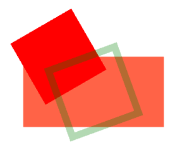
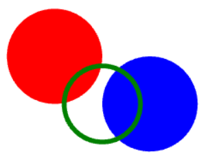

!!! note
    This page uses an older graphics engine, refer to [UI](../create_an_exercise/UI.md) for the latest version.
    This page still explains e.g. animations that are not yet explained elsewhere.

## Enable graphics and animations

In the Freecode creator there is a page with settings for graphics, in this tab you have to enable "Uses canvas" in order to enable the canvas where graphics are displayed.
In order to use animations you also have to check "has Canvas animation".
Without the second option the canvas will only display 1 static update when running the code.


## Accessing the canvas object

The canvas object which is used to create graphical objects is part of the context.
To create a simple red circle placed `5` units into the canvas, sized `2` canvas units, one can use
```  
self._context.canvas.new_circle(2, 'red', x=5, y=5)
```
To avoid writing "self._context." every time one can temporarily store the canvas as a separate variable.
```
canvas = self._context.canvas
canvas.new_circle(2, 'red', x=5, y=5)
```

## Creating graphical objects

There are 6 main types of elements that can be used in the canvas; `rectangle`, `circle`, `polygon`, `text`, `bitmap`, and `spritesheet`.
All of the elements are created by accessing their respective method in the canvas object.
All color properties are set using CSS compatible names, such as `"#FF6347"` or `"red"`.
All rotation values are set using degrees.
Rotating halfway through a full rotation is 180 degrees.
The `z_index` is used to determine which object should overlap which.
A higher `z_index` means the object will be drawn on top of objects with a lower value if they overlap.
All positional arguments are either relative to the upper left corner of the canvas, or relative to origin of its own position.
If `x` and `y` are not set they will both be `0` by default.
If the `edge` argument is available and used the object will be an outline of the object with no fill color.


### `Rectangle`

```
new_rectangle(width, height, color, x=0, y=0, scale_x=1, scale_y=1, opacity=1, rotation=0, z_index=0, edge=None, pivot_x=0, pivot_y=0)
```
Creates and returns a graphical object of the type rectangle.
Rectangles are defined by their width, height, and color.
Their origin is in the middle of the shape and needs to be offset by half the width and height if you want to artificially move it to one of the corners.

???+ example "Adding three rectangles"
    ```
    a) canvas.new_rectangle(4, 2, '#FF6347', x=3, y=3)
    b) canvas.new_rectangle(2, 2, 'red', x=2, y=2, rotation=60)
    c) canvas.new_rectangle(2, 2, 'green', x=3, y=3, rotation=-20, edge=0.2, opacity=0.3)
    ```

{ loading=lazy }


### `Circle`

```
new_circle(radius, color, x=0, y=0, scale_x=1, scale_y=1, opacity=1, rotation=0, z_index=0, edge=None, pivot_x=0, pivot_y=0)
```

Creates and returns a graphical object of the type circle.
Circles are defined by their radius and their color.
Their origin is in the middle of the shape and needs to be offset by the radius if you want to artificially move it to one of the corners.

???+ example "Adding three circles"
    ```
    a) canvas.new_circle(1, 'red')
    b) canvas.new_circle(1, 'blue', x=2, y=1)
    c) canvas.new_circle(0.8, 'green', x=1, y=1, edge=0.1)
    ```

{ loading=lazy }


### `Polygon`

```
new_polygon(points, color, x=0, y=0, scale_x=1, scale_y=1, opacity=1, rotation=0, z_index=0, edge=None, pivot_x=0, pivot_y=0)
```

Creates and returns a graphical object of the type polygon.
Polygons are abstract shapes defined by a list of coordinates and a color.
The list contains pairs of x and y coordinates but without any special separation, e.g. `[x1, y1, x2, y2, x3, y3]`.

???+ example "Adding three polygons"
    ```
    a) canvas.new_polygon([0, 0, 5, 0, 2, 1], 'red', x=3, y=1, z_index=1)
    b) canvas.new_polygon([0, 0, 0, 2, 0.5, 2, 1, 1, 2, 2, 1, 0], 'blue', x=1, y=1, edge=0.3, z_index=3)
    c) canvas.new_polygon([0, 0, -2, 2, 2, 2, 3, 0], 'green', x=4, y=3, opacity=0.5, rotation=170, z_index=2)
    ```

{ loading=lazy }


#### `Polygon` Lines

To create a line, draw a polygon with just two points and edge set to the desired width of the line.
???+ example "Adding more polygons"
    ```
    # Will make a filled triangle
    canvas.new_polygon(points=[1,1, 2,2, 1,2], color='black')

    # Will make an empty triangle
    canvas.new_polygon(points=[1,3, 2,4, 1,4], color='black', edge=0.1)

    # Will make a line with edge as thickness
    canvas.new_polygon(points=[2,1, 3,2], color='red', edge=0.1)

    # Will make a curved line
    canvas.new_polygon(points=[3,1, 4,1, 4,2, 4,1], color='blue', edge=0.1)

    # Will make a curved line offset by x/y
    canvas.new_polygon(points=[0,0, 1,1, 1,0, 2,1, 1,0, 1,1], color='green', edge=0.1, x=2, y=3)

    # Make a tuple list, extend it with backtrack, convert to polygon points and create the polygon
    tuple_list=[(0,0), (0,1), (1,0), (0,-1), (-1,0), (-1,1), (0,2), (2,0), (1,-1)]
    tuple_list.extend(tuple_list[len(tuple_list)-2:0:-1])
    point_list = [num for tup in tuple_list for num in tup]
    canvas.new_polygon(points=point_list, color='magenta', edge=0.1, x=6, y=2)
    ```

{ loading=lazy }


### `Text`

```
new_text(text, size, color, x=0, y=0, text_align='left', scale_x=1,
         scale_y=1, opacity=1, rotation=0, z_index=0, pivot_x=0, pivot_y=0)
```

Creates and returns a graphical object of the type text.
Text is defined by the text, size, and color.
Origin is to the left of the text by default but can be changed with the text_align argument.
By default text_align is "left", other possible values are "right", and "center".

???+ example "Adding three texts"
    ```
    a) canvas.new_text('default left alignment', 0.8, 'blue', x=7, y=1)
    b) canvas.new_text('alignment also moves origin', 0.8, 'black', x=7, y=2, text_align='center')
    c) canvas.new_text('right alignment', 0.8, 'red', x=7, y=3, text_align='right')
    ```


### Bitmap

```
new_bitmap(width, height, image, x=0, y=0, scale_x=1, scale_y=1,
           opacity=1, rotation=0, z_index=0, color='white', pivot_x=0, pivot_y=0)
```

Creates and returns a graphical object of the type bitmap.
Width and height defines the size of the image, and will stretch the image if the original dimensions are not the same.
The image argument should be the name of the image as it is written in the graphics tab.

???+ example "Adding three bitmaps"
    ```
    a) canvas.new_bitmap(4, 4, 'striped_cat.png')
    b) canvas.new_bitmap(4, 4, 'striped_cat.png', x=4, y=1.5)
    c) canvas.new_bitmap(8, 4, 'striped_cat.png', x=4, y=2, rotation=20, color='red', opacity=0.3, z_index=-1, scale_x=-1)
    ```

{ loading=lazy }


### Sprite sheet

The sprite sheets requires that the defined image is the name of a compatible sprite sheet.
Check out the [Create Sprite Sheet](../create_an_exercise/Create_Sprite_Sheet.md) page to create your own sprite sheets compatible with the Future Skill platform.

```
new_spritesheet(width, height, image, animation='default', frame_index_start=None, frame_index_end=None, x=0, y=0, scale_x=1, scale_y=1, opacity=1, rotation=0, z_index=0, color='white', pivot_x=0, pivot_y=0)
```

Creates and returns a graphical object of the type sprite sheet, intended to be used for animations.
Width and height defines the size of the object to be drawn, if the dimensions are not the same in the sprite sheet then the image will be stretched.
Each individual image in an animation should be the same size or they will stretch weirdly.
The image argument should be the name of the sheet as it is written in the graphics tab.
The sprite sheet in the graphics tab should have an image atlas defined alongside of it, the atlas should contain information about where each individual image is placed in the sheet and what animations can be done with the sheet.
If no specific animation has been selected in the sprite_sheet ceation then the implementation will assume that there is an animation named "default" that it will use.
When adding a sprite sheet and its atlas it is possible to automatically generate the default animation which will play all the frames in the sheet.
It is also possible to personally define other animations in the same sheet and they can be utilized by setting the animation argument when creating the new_spritesheet in the code.
Each animation is defined as a list of frame names, by using the frame_index_start and frame_index_end arguments in the implementation it is possible to only run part of an animation, or to reverse the animation. 

???+ example "Adding three sprite sheets"
    ```
    a) canvas.new_spritesheet(2, 2, 'weird_sheet.png', x=1, y=1)
    b) canvas.new_spritesheet(2, 2, 'weird_sheet.png', x=3, y=1, frame_index_start=2, frame_index_end=0, scale_x=-1)
    c) canvas.new_spritesheet(1.5, 2, 'weird_sheet.png', x=5, y=1, animation='just_display_guy')
    ```


The "weird_sheet.png" used in the example only contains 3 very different images so it will be easy to see the difference in a static context, normally you want to use variations of the same image in each sheet in order to get nice animations.


### Animating graphical objects

Once a graphical object has been created there are various methods that can be used to manipulate them over time to create an animation.
All graphical objects have all methods listed below, but they might not work for all types.
For example rotating a circle, or setting a text on something that is not a "Text" will yield no noticeable change.

The time argument is always a percentage ranging from 0.0 to 1.0 (where 1.0 is equal to 100% or the end of the step), and represents when during a step the update will occur.
Most animations will render in a continuous manner, for example going from opacity 0 at 0% of a step to opacity 1 at 100% of a step will make the opacity change gradually over the step.
If you want to make an object suddenly change opacity at a specific time, then you need to set it to the current opacity just before making the change, e.g. opacity 0 at 0.49 and opacity 1 at 0.5.


### Composite objects

The following example shows both how a parent object can be set when creating a graphical object and how the parent can be changed later using set_parent.

???+ example "Changing parent"
    ```
    canvas = self._context.canvas
    self.squares = [canvas.new_rectangle(1,1, 'white', x=2+i*2, y=2) for i in range(5)]
    self.circle = canvas.new_circle(0.5, 'green', x=.5, y=.5, parent=self.squares[0])
    self.circle.set_parent(self.squares[0])
    text = canvas.new_text("wiiee", 0.4, 'lightgreen', x = 0, y=0, text_align='center')
    text.set_parent(self.circle)
    ```
Most operations in the section [Methods on graphical objects](Freecode_graphics.md#methods-on-graphical-objects) below will then apply to both parent and child object.

## Example of an animation

Our example animation uses a red rectangle standing on the ground (a black rectangle).
It is played out over two steps; in the first step the red rectangle is static and in the second step it falls to the ground (with higher speed towards the end of the second step).

!!! note
    To get an animation to work, go to the Graphics tab in Freecode Creator and check "Uses Canvas" and "Has Canvas Animation".

Freecode which implements this animation: [Freecode](https://futureskill.com/freecode-creator/602e752d1667cc6d98aee706) (can only be seen if logged in)

{ loading=lazy }

Image 1: The above animated gif shows our example animation as it looks in the Freecode canvas on our page.

{ loading=lazy }

Image 2: Note that the y axis starts from the top (y=0) and has increasing values of y the further down in the canvas we are, whereas x=0 is to the very left.
In this case the canvas is 20 units wide and 10 units high, so x can vary from 0 to 20 and y from 0 to 10.

{ loading=lazy }

Image 3: In the above picture there is a timeline showing our example animation over two steps.


**Explanation** (A, B , C etc. are shown in Image 3 above)

- A\) We have created the rectangle and it is so far static and the bottom right corner is at x=6 and y=9.
!!! note
    In Image 2 above the x and y values can be seen, the grey dots represent integer values of x and y.

The line in the Implementation of the Freecode is:

```
self.falling_rect = canvas.new_rectangle(2, 8, 'red', x=6, y=9, pivot_x=1, pivot_y=4)
```

Normally a rectangle is positioned using the center point (so we would use x=5, y=5).
However, in this case we use (pivot_x=1, pivot_y=4) which offsets the anchor point (pivot) by +1 on the x axis and +4 on the y axis.
This means (since the rectangle is 2 wide and 8 high) that we now position the rectangle using the bottom right corner, which is placed at (x=6, y=9).

- B\) The first step we don't carry out any animation, so the red rectangle is still static.

- C\) In the second step (1) we carry out a 45 degree rotation at time point (sub-step time) 0.7 and since the canvas will [tween](https://en.wikipedia.org/wiki/Inbetweening) the rectangle from time 0.0 to 0.7 it will have a 22.5 degree rotation at time 0.35.

- D\) At time 0.7 the rectangle will have a 45 degree rotation, around the anchor point at (x=6, y=9).

The line in the code is:

```
self.falling_rect.rotate(45, 0.7)
```

- E\) Again, a tween gives the rotation 67.5 degrees at time 0.85 as a result of the two rotation commands.

- F\) A final rotation at time 1.0 completes the full rotation of 90 degrees, and the red rectangle lies flat on the ground.

The line in the code is:

```
self.falling_rect.rotate(45, 1.0)
```

## Methods on graphical objects

`get_name()`
: Returns the name of the object. The name will be generated as a unique identifier.

`set_x(x, time=None)`
: Sets the x coordinate of the graphical object (relative to the upper left corner).

`get_x()`
: Returns the x coordinate of the graphical object (relative to the upper left corner).

`set_y(y, time=None)`
: Sets the y coordinate of the graphical object (relative to the upper left corner).

`get_y()`
: Returns the y coordinate of the graphical object (relative to the upper left corner).

`set_position(x, y, time=None)`
: Sets the x and y coordinate of the graphical object (relative to the upper left corner).

`get_position()`
: Returns the x and y coordinate of the graphical object (relative to the upper left corner).

`move(x=0, y=0, time=None)`
: Changes the x and y coordinate of the graphical object by the specified amount, relative to the objects previous coordinates.
For a smooth movement animation you first need to use move(0, 0, 0.0) followed by move(1, 0, 1.0), or it will just set the new position.

`set_z_index(z, time=None)`
: Sets the z index of the graphical object (higher z index objects are on top of lower ones).

`get_z_index()`
: Returns the z index of the graphical object (higher z index objects are on top of lower ones).

`set_scale_x(scale_x, time=None)`
: Sets the x scale of the graphical object (1 being default and 2 being twice the width).
Useful for changing a pictures x orientation without setting a negative width.

`get_scale_x()`
: Returns the x scale of the graphical object (1 being default and 2 being twice the width).

`set_scale_y(scale_y, time=None)`
: Sets the y scale of the graphical object (1 being default and 2 being twice the height).
Useful for changing a pictures y orientation without setting a negative height.

`get_scale_y()`
: Returns the y scale of the graphical object (1 being default and 2 being twice the height).

`set_scale(scale, time=None)`
: Sets the scale of the graphical object, both x and y (1 being default and 2 being twice the width and height).

`get_scale()`
: Returns the x and y scale of the graphical object (1 being default and 2 being twice the width and height).

`set_color(color, time=None)`
: Sets the color of the graphical object (CSS compatible colors, e.g. \#FF4D4D or red).

`set_opacity(opacity, time=None)`
: Sets the opacity of the graphical object (0 being completely transparent and 1 being opaque).

`get_opacity()`
: Returns the opacity of the graphical object (0 being transparent and 1 being opaque).

`set_rotation(rotation, time=None)`
: Sets the rotation of the graphical object (in degrees).

`get_rotation()`
: Returns the rotation of the graphical object (in degrees).

`rotate(rotation, time=None)`
: Rotates the graphical object by the specified amount, relative to the objects previous rotation (in degrees).

`set_parent(`<graphical_object>`)`
: Set the parent graphical object of this graphical objects.
Most operations in this list will then apply to both parent and child object.

`set_pivot(x=0, y=0, time=None)`
: Set the point around which an object should rotate relative to the regular origin.

`get_pivot()`
: Return the point around which an object should rotate relative to the regular origin.

`set_text(text, time=None)`
: Sets the text of the graphical object (only available on text objects).

`get_text()`
: Returns the text of the graphical object (only available on text objects).

`destroy()`
: Destroys the graphical object and removes it from the canvas (irreversible).
If you try to update an object after it has been destroyed your implementation might crash.


### Manually add animation step

It is possible to manually add animation steps without going through the natural step cycle.
This can be useful if you want to perform an extra step such as drawing a final score or perform some elaborate animation. `canvas.finish_step()` (or, an alias is `canvas.split_step()`)

All graphical operations performed after finish_step will occur in a new step.

The example Freecode from above uses `canvas.finish_step()` on row 93: [Freecode](https://app.futureskill.com/freecode-test-editor/602e752d1667cc6d98aee706) (can only be seen if logged in).
